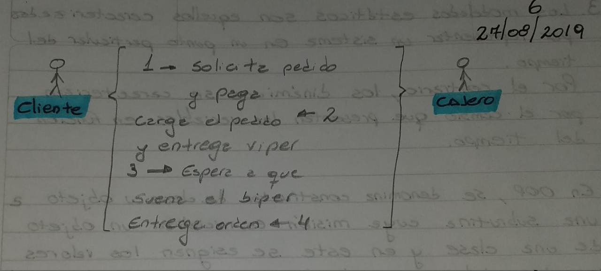

# Clase 03 \| 27/08/2019

## Graficos UML

## Cuestionario

### Preguntas

1. ¿En qué consiste UML como documentación?
2. ¿Qué son las entidades y las relaciones?
3. ¿Qué es el modelado estático?
4. ¿Qué es un constructor de clases?

